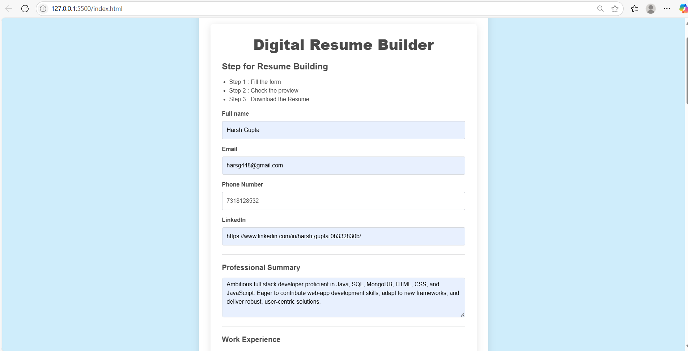
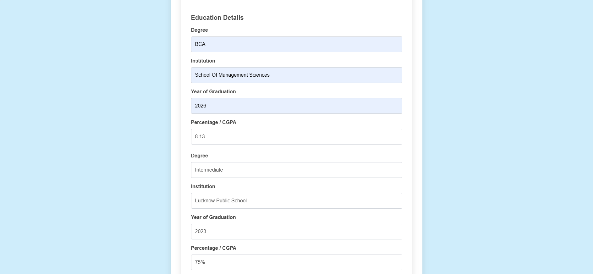
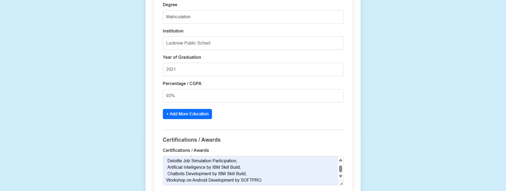
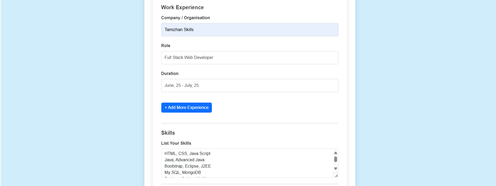
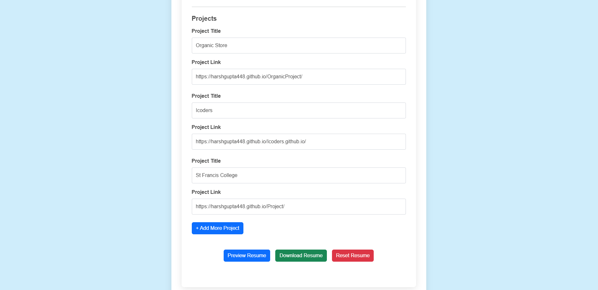
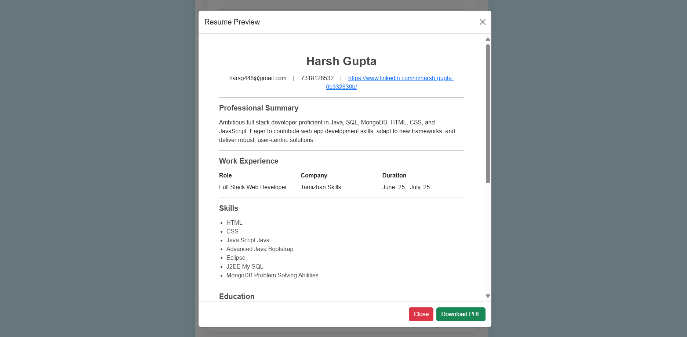
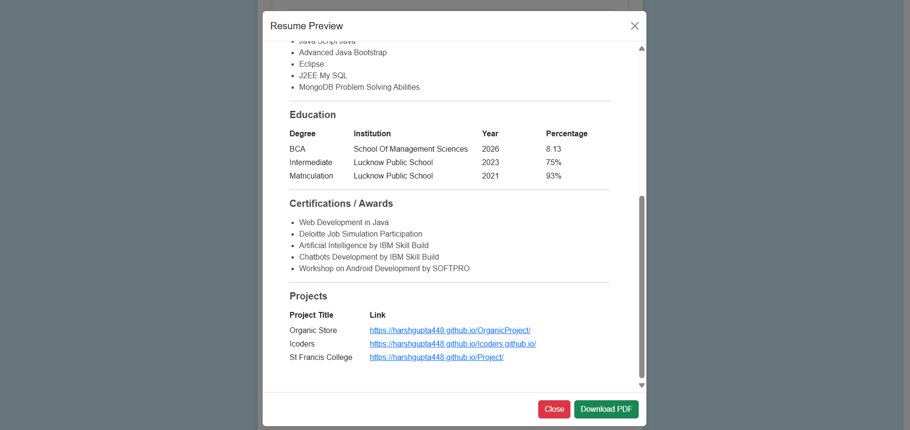
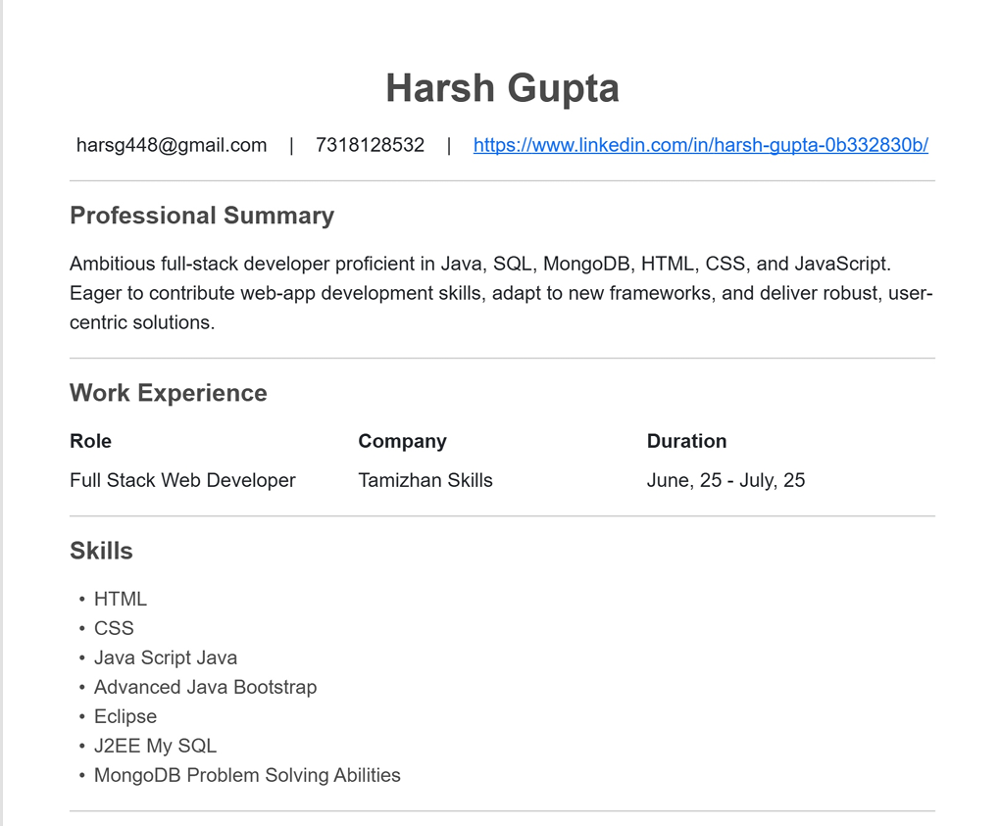
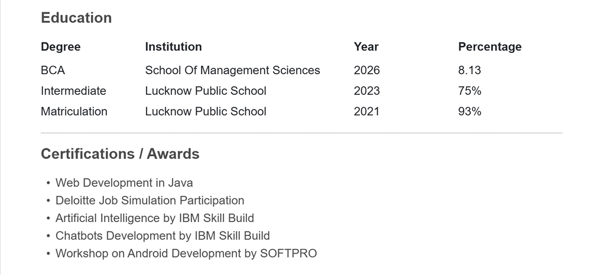
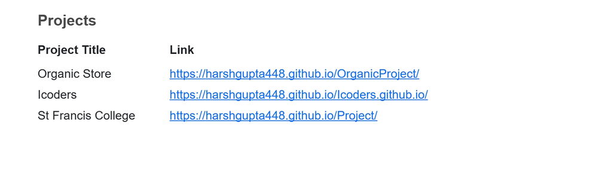

# Digital Resume Builder

This is a responsive Resume Builder web application that lets users:
- Fill personal, educational, and professional info
- Preview the resume before download
- Download a PDF version of the resume

## Features
- Add multiple education/work experience/project entries
- Dynamic preview in modal
- Hide empty sections in PDF
- ATS-friendly plain format
- Clean Bootstrap + custom styling

## Technologies Used
- HTML
- CSS (Bootstrap + Custom)
- JavaScript
- html2pdf.js

## Screenshots

## How to Use
1. Open `index.html` in any browser
2. Fill in the form with your details
3. Click **Preview** to view your resume
4. Click **Download PDF** to save it

## Demo
🎥 [Watch Video Demo](Recording.mp4)

---

© 2025 Harsh Gupta
